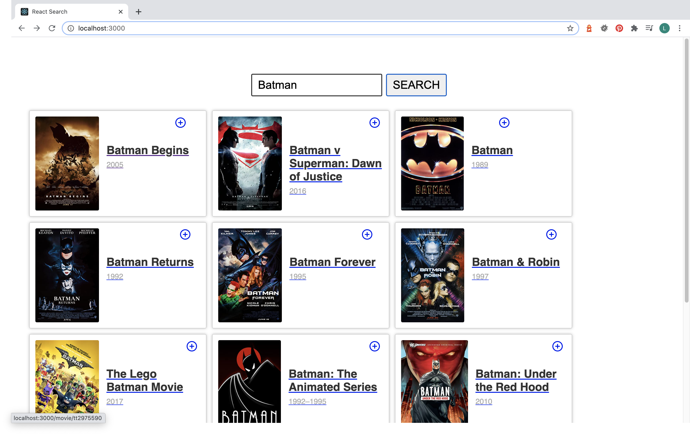

# My first React App

This project was done following a tutorial from Elephorm.

- Type of Challenge: `Learning challenge`

## Learning objectives

- Install and initiate a project node.js
- Create first React Components
- Use Proptypes
- Install and config react-router
- Get data from an API

## The mission

Create an app that display movies list, and make search inside with details.

Using the OMDB API :  <https://www.omdbapi.com/>
`Note : You need to generate your own key and make a config file`

